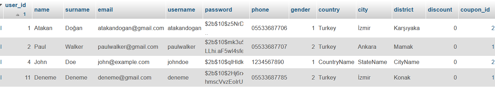
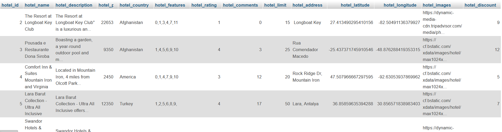
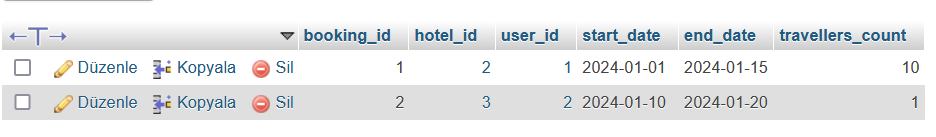
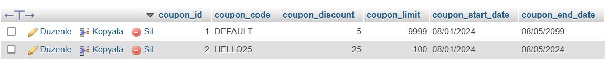

# Hotel Booking System

This repository contains the backend code for a Hotel Booking System built using Node.js, Express, and Sequelize as the ORM for PostgreSQL. The system includes features such as user authentication, hotel information retrieval, and booking functionality.

https://github.com/atakandgn/hotels_booking/assets/108396649/81a3f11d-c162-41e2-b83d-16bfa294e5cc

## Project Structure

### Authentication Routes (`authRoutes.js`)

- **`POST /login`**: Handles user login with username and password. Validates user credentials and generates a JWT token upon successful login.

- **`POST /register`**: Handles user registration, validating user input, hashing the password, and creating a new user in the database.

- **`POST /googleAuth`**: Handles Google authentication, validating the incoming data, creating a JWT token, and returning it.

### Hotel Routes (`hotelRoutes.js`)

- **`GET /getHotels`**: Retrieves a list of all hotels with their basic information.

- **`GET /getHotelDetail/:id`**: Retrieves detailed information about a specific hotel based on the provided `hotelId`.

- **`POST /getHotelsByFilter`**: Filters hotels based on country, start date, end date, and traveler count. Ensures that hotels meet the specified criteria for availability.

### Authentication Middleware (`authenticateToken.js`)

A middleware function to authenticate JWT tokens. It checks for a valid token in the request header and decodes it to verify the user's identity.

### Sequelize Helper (`sequelize.js`)

- **`initializeSequelize`**: Initializes the Sequelize instance, connects to the PostgreSQL database, and exports the Sequelize instance. It also handles SSL configuration for secure connections.

## Database Models and Associations (`sequelizemodels.js`)

### Users Model

- Represents user details such as name, email, username, and password.
- Contains information about the user's location, including country, city, and district.
- Associates with the Coupons model through the `coupon_id`.

### Hotels Model

- Represents information about hotels, including name, description, price, and features.
- Contains details about the location of the hotel, such as country, address, latitude, and longitude.
- Associates with the Booking model through the `hotel_id`.
- Utilizes a `hotel_discount` field to provide discounts on hotel prices.

### Booking Model

- Represents a booking made by a user for a particular hotel.
- Includes details such as the start date, end date, and the number of travelers.
- Associates with both Users and Hotels models through `user_id` and `hotel_id` respectively.

### Coupons Model

- Represents discount coupons that users can have.
- Contains information about the coupon code, discount percentage, limit, and validity period.
- Associates with the Users model through the `coupon_id`.

These associations create a relational structure among Users, Hotels, Booking, and Coupons, allowing for seamless querying and retrieval of related data. For example, a booking is associated with both a user and a hotel, and users may have associated coupons.

## Database Tables

The database contains the following tables:

- **`users`**: 
- **`hotels`**:
- **`bookings`**:
- **`coupons`**:

## Live Demo

Visit the [live demo](https://hotelclient-v68w.onrender.com/) to explore the Hotel Booking System. The system integrates Google authentication for a seamless login experience.

## How to Use

1. Clone the repository.
2. Install dependencies using `npm install`.
3. Configure environment variables in a `.env` file.
4. Run the application using `npm start`.

Note: Ensure that you have Node.js and npm installed on your machine.

Feel free to customize and extend the code to fit your specific project requirements. If you encounter any issues or have questions, please refer to the documentation or open an issue in the repository.
